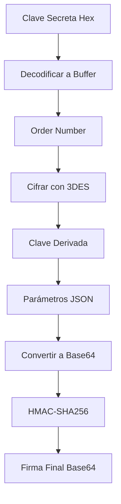
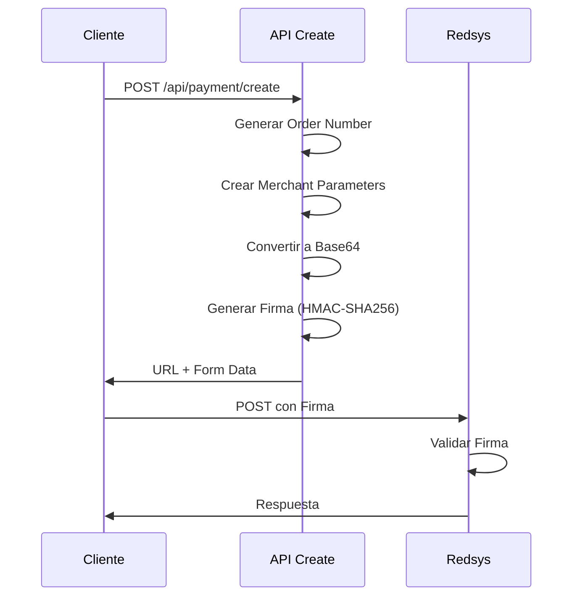
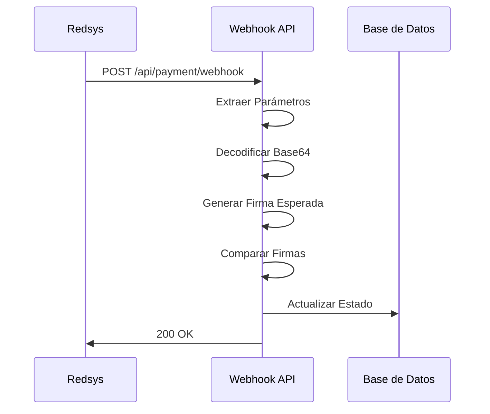

# Esquema de Procesamiento y Cifrado de Claves Redsys

## 🔐 Flujo Completo de Seguridad Redsys

### 1. CONFIGURACIÓN INICIAL DE CLAVES

#### 1.1 Formato de Clave Original
```
Clave Base64 Original: sq7HjrUOBfKmC576ILgskD5srU870gJ7
Longitud: 32 caracteres
```

#### 1.2 Conversión a Hexadecimal (Solución SIS0042)
```javascript
// Proceso de conversión
const base64Buffer = Buffer.from(secretKey, 'base64');
const hexKey = base64Buffer.toString('hex');
```

**Resultado:**
```
Clave Hexadecimal: b2aec78eb50e05f2a60b9efa20b82c903e6cad4f3bd2027b
Longitud: 64 caracteres
```

### 2. PROCESAMIENTO DE CLAVES EN DIFERENTES COMPONENTES

#### 2.1 Variables de Entorno
```env
# .env.local
REDSYS_MERCHANT_CODE=367529286
REDSYS_TERMINAL=1
REDSYS_SECRET_KEY=b2aec78eb50e05f2a60b9efa20b82c903e6cad4f3bd2027b
REDSYS_ENVIRONMENT=https://sis-t.redsys.es:25443/sis/realizarPago
```

#### 2.2 Componentes que Utilizan la Clave

| Componente | Ubicación | Uso de la Clave |
|------------|-----------|-----------------|
| **Creación de Pago** | `app/api/payment/create/route.ts` | Generar firma para preautorización |
| **Confirmación** | `app/api/payment/confirm/route.ts` | Generar firma para confirmación |
| **Webhook** | `app/api/payment/webhook/route.ts` | Validar firma entrante |
| **Función Edge** | `supabase/functions/redsys-webhook/index.ts` | Validar webhook en Supabase |
| **Librería** | `lib/redsys-signature.ts` | Algoritmo oficial de firma |

### 3. ALGORITMO DE FIRMA OFICIAL (lib/redsys-signature.ts)

#### 3.1 Proceso de Generación de Firma


#### 3.2 Pasos Detallados

**Paso 1: Decodificación de Clave**
```javascript
const decodedSecretKey = Buffer.from(secretKey, 'hex');
// Convierte: b2aec78eb50e05f2a60b9efa20b82c903e6cad4f3bd2027b
// A: Buffer de 32 bytes
```

**Paso 2: Cifrado 3DES**
```javascript
const derivedKey = encrypt3DES(order, decodedSecretKey);
// Usa el número de pedido para cifrar la clave secreta
// Resultado: Buffer de 24 bytes (clave derivada)
```

**Paso 3: Generación HMAC-SHA256**
```javascript
const hmac = crypto.createHmac('sha256', derivedKey);
hmac.update(merchantParametersBase64, 'utf8');
const signature = hmac.digest('base64');
```

### 4. FLUJO DE PROCESAMIENTO POR OPERACIÓN

#### 4.1 Creación de Preautorización


#### 4.2 Validación de Webhook


### 5. FORMATOS DE DATOS EN CADA ETAPA

#### 5.1 Parámetros del Comercio
```javascript
// JSON Original
{
  "DS_MERCHANT_AMOUNT": "000000018000",
  "DS_MERCHANT_ORDER": "175328862176",
  "DS_MERCHANT_MERCHANTCODE": "367529286",
  "DS_MERCHANT_CURRENCY": "978",
  "DS_MERCHANT_TRANSACTIONTYPE": "1",
  "DS_MERCHANT_TERMINAL": "001"
}

// Base64
eyJEU19NRVJDSEFOVF9BTU9VTlQiOiIwMDAwMDAwMTgwMDAiLCJEU19NRVJDSEFOVF9PUkRFUiI6IjE3NTMyODg2MjE3NiIsIkRTX01FUkNIQU5UX01FUkNIQU5UQ09ERSI6IjM2NzUyOTI4NiIsIkRTX01FUkNIQU5UX0NVUlJFTkNZIjoiOTc4IiwiRFNfTUVSQ0hBTlRfVFJBTlNBQ1RJT05UWVBFIjoiMSIsIkRTX01FUkNIQU5UX1RFUk1JTkFMIjoiMDAxIn0=
```

#### 5.2 Datos para Firma
```javascript
// Concatenación: Order + MerchantParametersBase64
const dataToSign = orderNumber + merchantParametersBase64;
// Ejemplo: "175328862176" + "eyJEU19NRVJDSEFOVF9BTU9VTlQiOiIwMDAwMDAwMTgwMDAiLCJEU19NRVJDSEFOVF9PUkRFUiI6IjE3NTMyODg2MjE3NiIsIkRTX01FUkNIQU5UX01FUkNIQU5UQ09ERSI6IjM2NzUyOTI4NiIsIkRTX01FUkNIQU5UX0NVUlJFTkNZIjoiOTc4IiwiRFNfTUVSQ0hBTlRfVFJBTlNBQ1RJT05UWVBFIjoiMSIsIkRTX01FUkNIQU5UX1RFUk1JTkFMIjoiMDAxIn0="
```

### 6. VALIDACIÓN Y VERIFICACIÓN

#### 6.1 Verificación de Firma
```javascript
// En webhook
const expectedSignature = generateSignature(order, merchantParameters, secretKey);
const isValid = signature === expectedSignature;
```

#### 6.2 Logs de Auditoría
```javascript
// Se registran todos los eventos de pago
await auditPaymentEvent(
  'payment_created',
  orderNumber,
  userId,
  serviceId,
  amount,
  success,
  request,
  metadata,
  description
);
```

### 7. SEGURIDAD Y MEJORES PRÁCTICAS

#### 7.1 Almacenamiento Seguro
- ✅ Claves en variables de entorno
- ✅ No en código fuente
- ✅ Diferentes claves por entorno

#### 7.2 Validación de Entrada
- ✅ Sanitización de datos
- ✅ Validación de esquemas
- ✅ Rate limiting

#### 7.3 Logging y Monitoreo
- ✅ Auditoría de transacciones
- ✅ Logs de errores
- ✅ Métricas de rendimiento

### 8. SCRIPTS DE DIAGNÓSTICO Y MANTENIMIENTO

#### 8.1 Scripts Disponibles
- `convert-redsys-key.js` - Conversión de formato
- `fix-redsys-signature.js` - Diagnóstico SIS0042
- `verify-redsys-fix.js` - Verificación de solución
- `test-redsys-config.js` - Pruebas de configuración

#### 8.2 Uso de Scripts
```bash
# Convertir clave de Base64 a Hex
node scripts/convert-redsys-key.js

# Diagnosticar problemas de firma
node scripts/fix-redsys-signature.js

# Verificar configuración
node scripts/verify-redsys-credentials.js
```

### 9. ERRORES COMUNES Y SOLUCIONES

#### 9.1 Error SIS0042
**Problema:** Error en el cálculo de la firma
**Causa:** Clave en formato Base64 en lugar de Hexadecimal
**Solución:** Convertir clave usando `convert-redsys-key.js`

#### 9.2 Error de Validación
**Problema:** Firma no válida en webhook
**Causa:** Diferentes algoritmos de firma
**Solución:** Usar algoritmo oficial de `lib/redsys-signature.ts`

### 10. MONITOREO Y MÉTRICAS

#### 10.1 Métricas Clave
- Tasa de éxito de transacciones
- Tiempo de respuesta de firma
- Errores de validación
- Uso de recursos

#### 10.2 Alertas
- Errores SIS0042
- Fallos de webhook
- Tiempo de respuesta alto
- Errores de configuración

---

## 📋 Resumen del Flujo

1. **Configuración:** Clave hexadecimal en `.env.local`
2. **Creación:** Generar firma HMAC-SHA256 con clave derivada 3DES
3. **Validación:** Verificar firma en webhooks
4. **Auditoría:** Registrar todos los eventos
5. **Monitoreo:** Seguimiento de métricas y errores

Este esquema garantiza la seguridad y compatibilidad con el protocolo oficial de Redsys. 