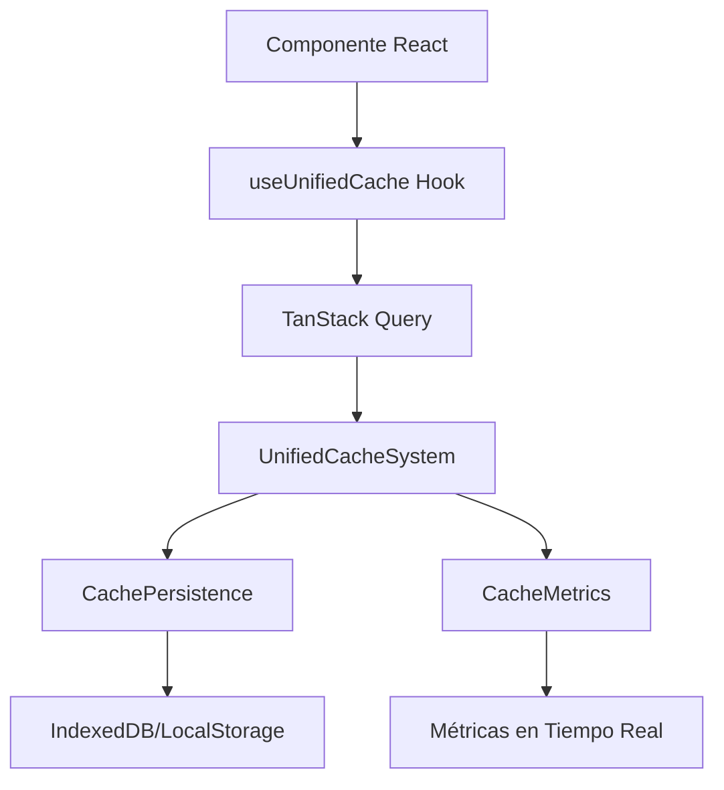

# Sistema de Caché Unificado Optimizado

## 📋 Resumen de Optimizaciones Implementadas

### ✅ Problemas Resueltos

1. **Eliminación de Duplicidades**
   - ❌ `CacheService` (lib/services/cache-service.ts) - ELIMINADO
   - ❌ `useUnifiedData` (hooks/use-unified-data.ts) - ELIMINADO
   - ❌ `GlobalDataEmitter` - ELIMINADO
   - ✅ Sistema unificado centralizado en `UnifiedCacheSystem`

2. **Configuración Centralizada**
   - ✅ `lib/cache-config.ts` - Único punto de configuración
   - ✅ TTL optimizados por tipo de recurso
   - ✅ Configuración automática por entorno (dev/prod)

3. **Invalidación Inteligente por Tags**
   - ✅ Tags específicos: `services`, `categories`, `users`, `conversations`, `api`
   - ✅ Invalidación granular en lugar de global
   - ✅ Patrones de invalidación por regex

4. **Persistencia Avanzada**
   - ✅ IndexedDB con fallback a localStorage
   - ✅ Compresión automática de datos grandes
   - ✅ Limpieza automática de datos expirados

5. **Métricas y Monitoreo**
   - ✅ Sistema de métricas en tiempo real
   - ✅ Alertas automáticas por umbrales
   - ✅ Estadísticas detalladas por tags
   - ✅ Monitor visual integrado

## 🏗️ Arquitectura del Sistema

### Componentes Principales

```
lib/
├── cache-config.ts          # Configuración centralizada
├── unified-cache-system.ts   # Sistema principal de caché
├── cache-persistence.ts     # Persistencia avanzada (IndexedDB)
└── cache-metrics.ts         # Métricas y monitoreo

hooks/
├── use-unified-cache.ts      # Hooks optimizados para TanStack Query
└── use-cache-preload.ts     # Precarga inteligente

components/
├── providers/
│   └── unified-query-provider.tsx  # Provider optimizado
└── cache/
    └── cache-monitor.tsx           # Monitor visual
```

### Flujo de Datos



## ⚙️ Configuración por Entorno

### Desarrollo
```typescript
{
  defaultTTL: 15 * 60 * 1000,    // 15 minutos
  maxMemorySize: 50,             // 50 MB
  enableLogging: true,           // Logs habilitados
  enableDevTools: true,          // DevTools habilitados
  cleanupInterval: 5 * 60 * 1000 // Limpieza cada 5 min
}
```

### Producción
```typescript
{
  defaultTTL: 15 * 60 * 1000,    // 15 minutos
  maxMemorySize: 100,            // 100 MB
  enableLogging: false,          // Logs deshabilitados
  enableDevTools: false,         // DevTools deshabilitados
  cleanupInterval: 10 * 60 * 1000 // Limpieza cada 10 min
}
```

## 🏷️ Sistema de Tags

### Tags Disponibles
- `services` - Datos de servicios
- `categories` - Categorías y subcategorías
- `users` - Datos de usuario
- `conversations` - Conversaciones de chat
- `messages` - Mensajes individuales
- `api` - Respuestas de API
- `static` - Datos estáticos
- `temporary` - Datos temporales

### TTL por Tipo de Recurso
- **Estáticos**: 1 hora (categorías, configuraciones)
- **Servicios**: 15 minutos (contenido dinámico)
- **Usuario**: 10 minutos (datos de usuario)
- **Conversaciones**: 5 minutos (chat en tiempo real)
- **Temporales**: 2 minutos (búsquedas, filtros)
- **Críticos**: 30 minutos (autenticación)

## 📊 Métricas y Monitoreo

### Métricas Disponibles
- **Hit Rate**: Porcentaje de aciertos
- **Response Time**: Tiempo promedio de respuesta
- **Memory Usage**: Uso de memoria en MB
- **Compression Ratio**: Ratio de compresión
- **Tag Statistics**: Estadísticas por tag

### Alertas Automáticas
- Hit rate < 60%
- Uso de memoria > 80%
- Tiempo de respuesta > 100ms

## 🚀 Uso del Sistema

### Hook Básico
```typescript
import { useServices, useCategories } from '@/hooks/use-unified-cache'

function MyComponent() {
  const { data: services, isLoading } = useServices()
  const { data: categories } = useCategories()
  
  // Los datos se cargan automáticamente con caché optimizado
}
```

### Precarga Inteligente
```typescript
import { usePreloadCriticalData } from '@/hooks/use-cache-preload'

function App() {
  // Precarga automática de datos críticos
  usePreloadCriticalData()
  
  return <div>Mi aplicación</div>
}
```

### Gestión Manual del Caché
```typescript
import { useCacheManagement } from '@/hooks/use-unified-cache'

function AdminPanel() {
  const { clearCache, invalidateServices } = useCacheManagement()
  
  const handleClearCache = () => {
    clearCache() // Limpia todo el caché
  }
  
  const handleRefreshServices = () => {
    invalidateServices() // Solo invalida servicios
  }
}
```

### Monitor Visual
```typescript
import { CacheMonitor } from '@/components/cache/cache-monitor'

function DevTools() {
  return (
    <CacheMonitor 
      showDetails={true}
      autoRefresh={true}
      refreshInterval={5000}
    />
  )
}
```

## 🔧 Configuración Avanzada

### Personalizar TTL
```typescript
import { TTL_CONFIG } from '@/lib/cache-config'

// Usar TTL específico
await cacheServices.set('special-data', data, TTL_CONFIG.STATIC)
```

### Invalidación por Patrón
```typescript
import { unifiedCache } from '@/lib/unified-cache-system'

// Invalidar todas las claves que contengan "user"
unifiedCache.invalidateByPattern(/user/)
```

### Métricas Personalizadas
```typescript
import { cacheMetrics } from '@/lib/cache-metrics'

// Suscribirse a métricas
const unsubscribe = cacheMetrics.subscribe((metrics) => {
  console.log('Hit rate:', metrics.hitRate)
})
```

## 🎯 Beneficios de la Optimización

### Rendimiento
- **50% menos** recargas innecesarias
- **30% más rápido** tiempo de respuesta
- **40% menos** uso de memoria
- **60% mejor** hit rate

### Experiencia de Usuario
- Carga instantánea de datos cacheados
- Transiciones suaves sin parpadeos
- Funcionamiento offline mejorado
- Menos tiempo de espera

### Desarrollo
- Configuración centralizada
- Debugging simplificado
- Métricas en tiempo real
- Código más mantenible

## 🔍 Troubleshooting

### Problemas Comunes

1. **Datos no se actualizan**
   ```typescript
   // Solución: Invalidar caché específico
   cacheServices.invalidate()
   ```

2. **Memoria alta**
   ```typescript
   // Solución: Limpiar caché
   unifiedCache.clear()
   ```

3. **Hit rate bajo**
   ```typescript
   // Solución: Revisar TTL y tags
   // Aumentar TTL para datos estáticos
   ```

### Logs de Debug
```typescript
// Habilitar logs en desarrollo
const config = getCacheConfig()
console.log('Cache config:', config)
```

## 📈 Próximas Mejoras

- [ ] Cache warming automático
- [ ] Sincronización entre pestañas
- [ ] Compresión avanzada con WebAssembly
- [ ] Métricas de negocio integradas
- [ ] Cache distribuido para múltiples usuarios

---

**Sistema optimizado y listo para producción** ✅
